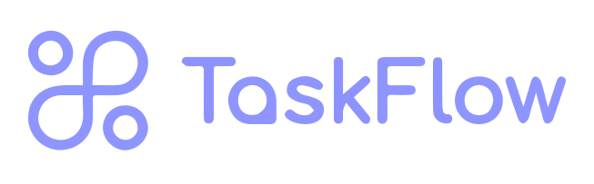

# TaskFlow by Aegile
<a name="readme-top"></a>

<!-- https://www.markdownguide.org/basic-syntax/#reference-style-links -->

<!-- [![Contributors][contributors-shield]][contributors-url]
[![Forks][forks-shield]][forks-url]
[![Stargazers][stars-shield]][stars-url]
[![Issues][issues-shield]][issues-url]
[![MIT License][license-shield]][license-url]
[![LinkedIn][linkedin-shield]][linkedin-url] -->

<!-- PROJECT LOGO & DESCRIPTION & IMAGES -->
<br />
<div align="center">
  <a href="https://github.com/LexicusRex/ever-flow">
    
  </a>

  <p align="center">
    An integrated productivity platform centred around collaborative writing, workflow management and performance evaluation.
    <br />
    <!-- <a href="https://github.com/LexicusRex/ever-flow"><strong>❌Explore the docs »</strong></a>
    <br /> -->
    <br />
    <a href="#about-the-project">About The Project</a>
    ·
    <a href="#getting-started">Getting Started</a>
    ·
    <!-- <a href="#usage">Usage</a>
    · -->
    <a href="#roadmap">Roadmap</a>
    ·
    <a href="#license">License</a>
    ·
    <a href="#contact">Contacts</a>
    ·
    <a href="#acknowledgments">Acknowledgments</a>
  </p>
</div>

<!-- PROJECT FEATURES -->

<!-- 
 -->

## About The Project

A user-friendly web-based word processor with integrated project management tools
targeting students and educators in higher education institutions.

The application will measure, track and distribute student performance metrics in collaboration projects to educators to allow for effective evaluation and conflict resolution.

### Built With

<div style="display: flex">

[![Docker][docker-shield]][docker-url]
[![React][react-shield]][react-url]
[![SQLite][SQLite-shield]][SQLite-url]
[![MUI][MUI-shield]][MUI-url]
[![Python][python-shield]][python-url]
[![Flask][flask-shield]][flask-url]
[![ChatGPT][chatgpt-shield]][chatgpt-url]
<!-- [![Pandas][pandas-shield]][pandas-url] -->
<!-- [![Chart.js][chartjs-shield]][chartjs-url] -->
<!-- [![JWT][jwt-shield]][jwt-url] -->
<!-- [![npm][npm-shield]][npm-url] -->
<!-- [![Node.js][nodejs-shield]][nodejs-url] -->
<!-- [![React Router][react-router-shield]][react-router-url] -->

</div>

<!-- GETTING STARTED -->

## Getting Started

To get this project going locally, please ensure the following.

### Prerequisites
-   [Docker][docker-url]
    -   Docker is a containerisation platform that allows for the easy deployment of applications. For more, please head to their website [here](https://www.docker.com/).
    -   If you are using Windows, ensule WSL 2 is enabled on your machine. [Read more here](https://docs.docker.com/desktop/wsl/) 
### Installation
1. Install [Docker for desktop][docker-url].
2. `git clone` this repository to your machine. Alternatively, if you have a ZIP download of the source code, extract it to a desired location.
3. Ensure the Docker for Desktop client is running.
4. Navigate to the root of the repository. There should be a `docker-compose.yml` file there.
5. Run the command (for the initial setup):
    ```console
    $ docker-compose up --build
    ```
6. Please wait for Docker to build the container. (This may take upwards of 5-7 minutes depending on your machine.)
7. Once the build is complete, you should see the following message

    ```console
    ...
    Compiled successfully!
    taskflow-by-aegile-client-1  |
    taskflow-by-aegile-client-1  | You can now view helicopter in the browser.
    taskflow-by-aegile-client-1  |
    taskflow-by-aegile-client-1  |   Local:            http://localhost:3000
    taskflow-by-aegile-client-1  |   On Your Network:  http://172.26.0.3:3000
    taskflow-by-aegile-client-1  |
    taskflow-by-aegile-client-1  | Note that the development build is not optimized.
    taskflow-by-aegile-client-1  | To create a production build, use npm run build.
    taskflow-by-aegile-client-1  |
    taskflow-by-aegile-client-1  | webpack compiled successfully
    ```
8. Navigate to `http://localhost:3000` in your preferred browser application.
9. For subsequent Docker startups, use:
    ```console
    $ docker-compose up
    ```
#### VSCode Dev Container
Alternatively, you can use the VSCode Dev Container to run the application.
**Instead** of `docker-compose up --build`, open the **`taskflow-by-aegile/backend`**
directory in a VSCode Dev Container. Appropriate extensions will install automatically.

To edit the frontend, navigate to the Remote Explorer tab on the left side of the VSCode window and open the client container in a new window.

Navigate to `http://localhost:3000` in your preferred browser application.


## Restarting the Docker
To restart the Docker, you have to cancel the current Docker process by entering Ctrl-C into the command line terminal. 
You should see the following output once the Docker has stopped:
```sh
Gracefully stopping... (press Ctrl+C again to force)
Aborting on container exit...
[+] Stopping 2/2
✔ Container taskflow-by-aegile-client-1  Stopped                                                                              6.1s
✔ Container taskflow-by-aegile-server-1  Stopped                                                                             10.8s
canceled
```
Now to start a new Docker process, simply run `docker-compose up`. 
You should see a similar message on the command line terminal from step 7 in the installation guide above.

To ensure that the Docker restarts smoothly, please log out of your account in the current TaskFlow instance before cancelling the current Docker process.

<!-- 
## Setup Configurations (Optional)
To change configuration settings for the server, open the "__config__.py" file in “backend/src”. 
The file will look like the following:

```py
# in seconds
# 1 day = 86400 seconds
# Use under 5 minutes for testing purposes
# 5 minutes = 300 seconds
# 4 minutes = 240 seconds
# 3 minutes = 180 seconds
# 2 minutes = 120 seconds
# 1 minute = 60 seconds
ANALYTICS_TIMESPAN = 60
# Set to either True or False
# Set to False to wipe all data on the backend (database, user reports, user analytics) when running docker-compose
# Set to True use existing data stored in the backend
DATA_PERSISTENCE = False
```
Here, you can change the `ANALYTICS_TIMESPAN` constant, which dictates the number of seconds between each update of the user and project analytics. 
The `DATA_PERSISTENCE` constant can also be switched between `False` and `True`. 
  If `False` - running “docker-compose up” will wipe all data on the backend. 
  If `True` - the backend data will persist between Docker restarts. -->

<!-- USAGE EXAMPLES -->

<!-- ## Usage

❌

Use this space to show useful examples of how a project can be used. Additional screenshots, code examples and demos work well in this space. You may also link to more resources. -->

<!-- _For more examples, please refer to the [Documentation](https://example.com)_ -->

<!-- ROADMAP -->

## Roadmap

### User Interface:

-   [x] Authorisation ✅
-   [x] Projects ✅
-   [x] Tasks ✅
-   [ ] Word processor 🔃
-   [ ] Dashboard 🔃
-   [ ] Taskboards 🔃
-   [ ] Analytics page 🔃
-   [ ] Timeline

### Functionality

- [x] Database integration (SQLite3) ✅
- [ ] User performance evaluation 🔃
- [ ] User report generation 🔃
- [ ] Custom project metrics for tracking and analytics 🔃
- [ ] Semantic evaluation within word processor

See the [open issues](https://github.com/LexicusRex/ever-flow/issues) for a full list of proposed features (and known issues).

<!-- LICENSE -->

## License

<!-- Currently unlicensed. The **default copyright laws apply**. You may **NOT** distribute, reproduce or derive works from this project. -->

Distributed under the MIT License. See `LICENSE.txt` for more information.

<!-- CONTACT -->

## Contacts

<!--
LexicusRex - [@twitter_handle](https://twitter.com/twitter_handle) - email@email_client.com -->

GitHub [@LexicusRex](https://github.com/LexicusRex) &nbsp;&middot;&nbsp;
LinkedIn [Alex Xu](https://www.linkedin.com/in/alex-tian-xu/) &nbsp;&middot;&nbsp;
Project Link: [ever-flow](https://github.com/LexicusRex/taskflow-by-aegile)

GitHub [@samyu1204](https://github.com/samyu1204)

<!-- ACKNOWLEDGMENTS -->

## Acknowledgments

This project uses the following open source modules:

-   [Node.js](https://nodejs.org/)
-   [react-router-dom](https://github.com/remix-run/react-router)
-   [Material UI](https://mui.com/)
-   [React](https://reactjs.org/)
-   [SQLite](https://www.sqlite.org/index.html)
-   [Python](https://www.python.org/)
-   [Flask](https://flask.palletsprojects.com/en/2.0.x/)
-   [Chart.js](https://www.chartjs.org/)
-   [JWT](https://jwt.io/)
-   [npm](https://www.npmjs.com/)
-   [Pandas](https://pandas.pydata.org/)
-   [Docker](https://www.docker.com/)
-   [Docker Compose](https://docs.docker.com/compose/)
-   [ChatGPT](http://openai.com/)
-   [notistack](https://iamhosseindhv.com/notistack)
-   [compressorjs](https://fengyuanchen.github.io/compressorjs/)
-   [react-chartjs-2](https://github.com/reactchartjs/react-chartjs-2)
-   [react-time-ago](https://gitlab.com/catamphetamine/react-time-ago)
<!-- -   [React Quill]( -->

<!-- MARKDOWN LINKS -->

[linkedin-shield]: https://img.shields.io/badge/-LinkedIn-black.svg?style=for-the-badge&logo=linkedin&colorB=555
[linkedin-url]: https://linkedin.com/in/linkedin_username
[docker-shield]: https://img.shields.io/badge/docker-%230db7ed.svg?style=for-the-badge&logo=docker&logoColor=white
[docker-url]: https://www.docker.com/
[react-shield]: https://img.shields.io/badge/React-20232A?style=for-the-badge&logo=react&logoColor=61DAFB
[react-url]: https://reactjs.org/
[MUI-shield]: https://img.shields.io/badge/MUI-%230081CB.svg?style=for-the-badge&logo=mui&logoColor=white
[MUI-url]: https://mui.com/material-ui/
[SQLite-shield]: https://img.shields.io/badge/sqlite-%2307405e.svg?style=for-the-badge&logo=sqlite&logoColor=white
[SQLite-url]: https://www.sqlite.org/index.html
[python-shield]: https://img.shields.io/badge/python-3670A0?style=for-the-badge&logo=python&logoColor=ffdd54
[python-url]: https://www.python.org/
[pandas-shield]: https://img.shields.io/badge/pandas-%23150458.svg?style=for-the-badge&logo=pandas&logoColor=white
[pandas-url]: https://pandas.pydata.org/
[flask-shield]: https://img.shields.io/badge/flask-%23000.svg?style=for-the-badge&logo=flask&logoColor=white
[flask-url]: https://flask.palletsprojects.com/en/2.0.x/
[chartjs-shield]: https://img.shields.io/badge/chart.js-F5788D.svg?style=for-the-badge&logo=chart.js&logoColor=white
[chartjs-url]: https://www.chartjs.org/
[jwt-shield]: https://img.shields.io/badge/JWT-black?style=for-the-badge&logo=JSON%20web%20tokens
[jwt-url]: https://jwt.io/
[npm-shield]: https://img.shields.io/badge/npm-CB3837?style=for-the-badge&logo=npm&logoColor=white
[npm-url]: https://www.npmjs.com/
[nodejs-shield]: https://img.shields.io/badge/node.js-6DA55F?style=for-the-badge&logo=node.js&logoColor=white
[nodejs-url]: https://nodejs.org/en/
[react-router-shield]: https://img.shields.io/badge/React_Router-CA4245?style=for-the-badge&logo=react-router&logoColor=white
[react-router-url]: https://reactrouter.com/
[chatgpt-shield]: https://img.shields.io/badge/chatGPT-74aa9c?style=for-the-badge&logo=openai&logoColor=white
[chatgpt-url]: https://openai.com/